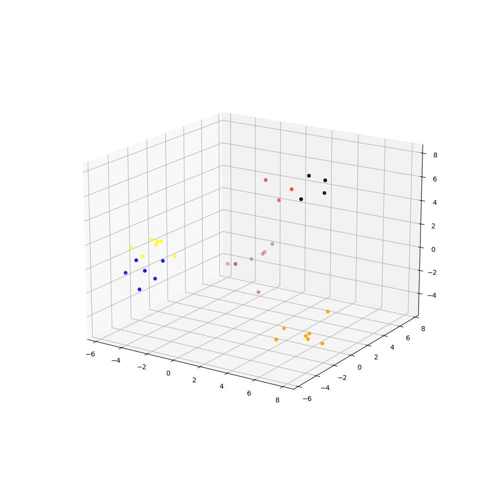

## FACE DETECTION for DBS management team
In this project we will be use retinaface for face detection some face keypoint features (left/right eyes and mouth). 
The keypoint features are then used to align the face to the correct orientation. The embeddings of the face is then extracted and compare against reference images using cosine similarity.

## Embeddings 
This method works because we can see that the pretrained model feature extraction is very good.
Below image shows the feature embeddings that are extracted using facenet and PCA'd to 3D for plotting



## Instruction
1. clone the repo 
2. install dependency using 
```
pip install -r requirements.dev
```
3. download model weights and place it in model_weights folder
- facenet: https://drive.google.com/file/d/17XcYnJorQ7wx6m7YLoah90-LB-QoF7zg/view?usp=sharing
- retinaface: https://drive.google.com/file/d/1xOaFDkN77Lira-lEeyFtwbUvm2F2YcvP/view?usp=sharing
4. populate the reference images in test_images folder. Each folder is a class and for a class, you can provide multiple images as references. The more image you provide, the better the accuracy
5. annotate video
Use --sample_rate <int> to speed up inference, check the declarable variables using (src/app.py --help)
```
## Can only accept and output MP4 files and therefore please include .mp4 extensions
python src/app.py --video_fp test_videos/test_video.mp4 --output_fp test_videos/output_2.mp4
```
